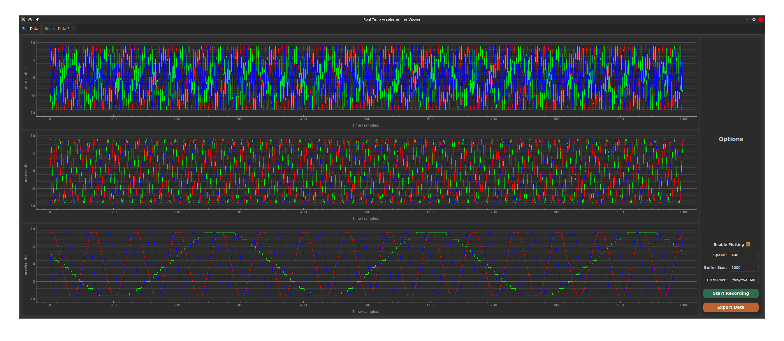
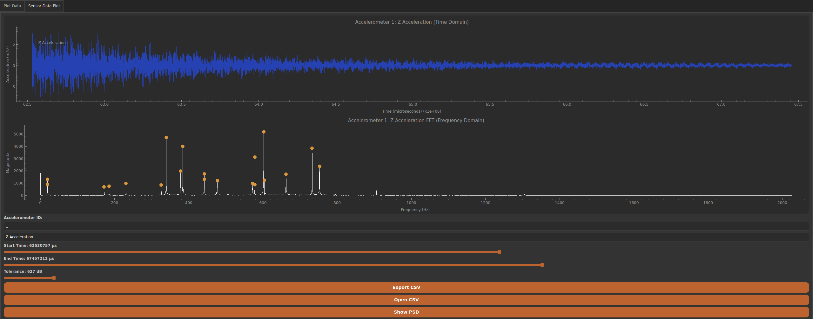

Here's a README that can serve as a foundational document for this project. You may need to add more details as the project evolves, especially if you add features or change dependencies.

---

# Vibrational Natural Frequency Analyzer

**Liberty University Capstone Project, Team 8**

This repository contains software designed by Team 8 from Liberty University as part of a Capstone project. The software is a tool used to analyze and determine vibrational natural frequencies, leveraging the PyQt and PyQtGraph libraries for its graphical user interface and visualizations.




## Table of Contents

- [Project Overview](#project-overview)
- [Features](#features)
- [Installation](#installation)
- [Usage](#usage)
- [Dependencies](#dependencies)
- [File Structure](#file-structure)
- [Contributing](#contributing)
- [License](#license)

---

## Project Overview

The goal of this software is to analyze the vibrational natural frequencies of a system or object. This analysis can be essential for applications in engineering and physics, particularly for understanding resonant behaviors and designing systems that avoid destructive resonance. 

The GUI is built using PyQt and PyQtGraph, providing an interactive, user-friendly interface for input, visualization, and analysis.

## Features

- **Interactive GUI** for data input and control
- **Real-time graphing** of frequency analysis results using PyQtGraph
- **Data visualization tools** for clearer insights into vibrational modes
- **Data export options** for saving results

## Installation

### Prerequisites

Make sure Python 3.7+ is installed on your system.

### Setting Up

1. Clone the repository:
   ```bash
   git clone https://github.com/your-username/vibrational-frequency-analyzer.git
   cd vibrational-frequency-analyzer
   ```

2. Install the required dependencies:
   ```bash
   pip install -r requirements.txt
   ```

> Note: `requirements.txt` should list all libraries required for this project (e.g., `pyqt5`, `pyqtgraph`). 

### Running the Application

After installation, run the application with the following command:
```bash
python main.py
```

## Usage

1. Launch the program using the above command.
2. Use the GUI to input system parameters required for vibrational analysis.
3. Select options to initiate analysis, view frequency plots, and adjust settings as needed.
4. Visualizations of the vibrational frequencies will be displayed in real-time.
5. Save or export your results using the provided options.

## Dependencies

The software relies on the following libraries:

- **PyQt5** - for creating the graphical user interface
- **PyQtGraph** - for plotting and visualizing frequency data
- **NumPy** (if applicable) - for numerical computations

Install these using `pip install -r requirements.txt` or individually as shown below:
```bash
pip install pyqt6 pyqtgraph numpy scipy
```

## File Structure

Here's an overview of the primary files and directories in this repository:

- **main.py** - Main entry point for the application
- **/ui/** - Directory containing UI components and layouts
- **/data/** - Directory for storing input or output data files
- **/utils/** - Utility scripts for various helper functions

> You can add specific details on additional files as needed.
